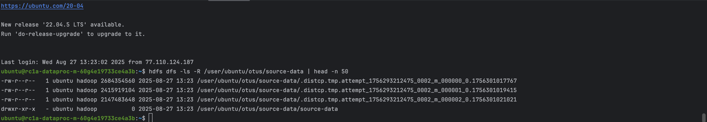
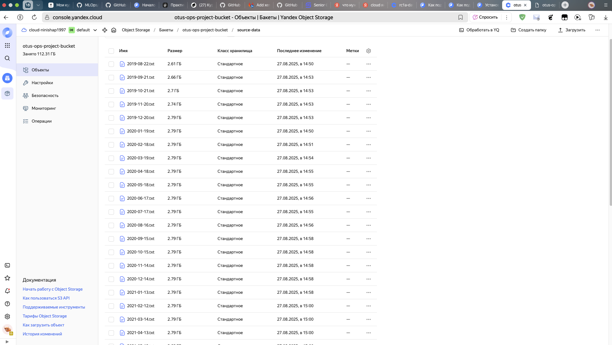

# Описание проектируемой антифрод-системы

## 1. Цели проектируемой антифрод-системы

На основе требований заказчика цели системы сформулированы следующим образом, чтобы быть конкретными, измеримыми и ориентированными на бизнес-аспекты, соответствующими бюджету, срокам, качеству и производительности.

**Основная цель**:\
Разработать и внедрить модуль на базе машинного обучения для выявления мошеннических транзакций в реальном времени в системе онлайн-платежей, чтобы минимизировать финансовые потери клиентов и компании, сохраняя конкурентоспособность.

**Подцели по качеству**:

- Достичь уровня, при котором на каждые 100 транзакций фиксируется не более 2 мошеннических операций с потерей средств.
- Обеспечить общий месячный ущерб не более 500 тыс. рублей (на уровне или лучше конкурентов).

**Подцели по производительности**:

- Обеспечить обработку до 400 транзакций в секунду в пиковые периоды (например, перед праздниками).
- Гарантировать задержку предсказания (latency) не более 100–200 мс на транзакцию, чтобы не замедлять систему.

**Подцели по ложным срабатываниям**:

- Ограничить долю ложноположительных срабатываний (false positives) не более 5% от всех транзакций, чтобы избежать оттока клиентов из-за отклонения легитимных операций.

**Подцели по бюджету и срокам**:

- Реализовать прототип за 3 месяца с бюджетом до 10 млн рублей (исключая зарплаты).
- Завершить проект за 6 месяцев, используя облачные ресурсы для инфраструктуры, чтобы избежать затрат на собственное оборудование.

**Подцели по конфиденциальности**:

- Обеспечить обработку данных без утечек конфиденциальной информации (данные клиентов в CSV-файлах).
- Использовать анонимизацию, шифрование и соблюдать стандарты GDPR/аналогичные.

Эти цели учитывают бюджетные ограничения, требования к качеству, производительность, ложные срабатывания и инфраструктуру.

## 2. Выбор метрики машинного обучения

Для задачи бинарной классификации (мошенническая транзакция vs. легитимная) рекомендуется использовать **Precision-Recall AUC (PR-AUC)** как основную метрику для оптимизации.

### Почему PR-AUC?

- Данные сильно несбалансированы: мошеннические транзакции составляют не более 2 на 100 (по оценке конкурентов).
- **Accuracy** бесполезна, так как модель, предсказывающая "не мошенничество" для всех транзакций, даст высокую accuracy, но не решит задачу.
- **Precision** минимизирует ложноположительные срабатывания (false positives), что критично для удержания клиентов (порог false positives &lt;5%).
- **Recall** максимизирует выявление мошеннических транзакций, минимизируя ущерб (не более 2 фрода на 100 транзакций, ущерб до 500 тыс. руб./мес.).
- **PR-AUC** комбинирует precision и recall, учитывая их trade-off, и лучше подходит для несбалансированных данных, чем ROC-AUC, так как не "разбавляется" true negatives.

### Как это поможет достичь целей?

- Оптимизация PR-AUC сбалансирует выявление фрода (высокий recall) и минимизацию ложных отклонений (высокий precision), что напрямую влияет на бизнес-метрики: ущерб и отток клиентов.
- Дополнительно можно мониторить **F1-score** для конкретного порога, но PR-AUC лучше для общей оценки модели.
- В продакшене можно комбинировать PR-AUC с бизнес-метрикой **expected loss** (ожидаемый ущерб = вероятность фрода \* сумма транзакции).

### Альтернативы

- **ROC-AUC** менее подходящ, так как игнорирует имбаланс данных.
- Чистый **recall** может привести к высокому числу false positives, что превысит 5% порог и вызовет отток клиентов.

## 3. Анализ особенностей проекта с использованием MISSION Canvas

| **Компонент** | **Описание** |
| --- | --- |
| **Mission (Миссия)** | Создать антифрод-систему на базе ML для реального времени обнаружения мошенничества в онлайн-платежах, снижая потери и сохраняя лояльность клиентов. Специфика: реал-тайм обработка, имбаланс данных, конфиденциальность. |
| **Impact (Влияние)** | **Положительное**: Снижение ущерба до &lt;500 тыс. руб./мес., конкурентоспособность, удержание клиентов (false positives &lt;5%). **Отрицательное**: Возможные задержки в транзакциях, если модель медленная. **Критерии оценки**: Мониторинг ущерба, churn rate (отток), A/B-тесты. |
| **Stakeholders (Заинтересованные стороны)** | \- **Заказчик (руководство компании)**: Бюджет 10 млн руб., сроки 3–6 мес.  - **Клиенты**: Минимизация ложных отклонений.  - **Команда (DS/ML Ops)**: Разработка, деплой в облаке.  - **Конкуренты**: Бенчмарк по качеству (2 фрода/100 транзакций).  - **Регуляторы**: Соблюдение конфиденциальности данных. |
| **Solutions (Решения)** | \- **ML-модель**: Классификация (e.g., XGBoost, Neural Nets) с фокусом на PR-AUC.  - **Инфраструктура**: Облако (Яндекс Cloud) для скейлинга до 400 TPS, MLOps (Kubernetes, MLflow).  - **Данные**: CSV-файлы, анонимизация (e.g., hashing клиентских данных).  - **Инструменты**: Python (scikit-learn, TensorFlow), CI/CD (GitHub Actions), мониторинг (Prometheus). |
| **Implementation (Реализация)** | Декомпозиция на этапы: сбор данных, feature engineering, обучение, деплой.  **Бюджет**: Облако \~2–3 млн руб., инструменты \~1 млн руб.  **Сроки**: Прототип за 3 мес. |
| **Obstacles (Препятствия)** | \- **Имбаланс данных**: Решение — oversampling (SMOTE), cost-sensitive learning.  - **Конфиденциальность**: Решение — federated learning или on-premise processing в облаке.  - **Пиковая нагрузка**: Решение — autoscaling в облаке.  - **Оценка**: Hold-out тесты на исторических данных. |
| **Needs (Потребности)** | \- Доступ к историческим CSV-данным.  - Бюджет на облако и инструменты.  - Команда: 2–3 DS/ML инженера. |

Этот анализ выделяет специфику проекта: фокус на реал-тайм, имбаланс данных, конфиденциальность. Требования формализованы (метрики, сроки), инструменты подобраны (ML Ops для деплоймента), критерии — бизнес-метрики + ML-метрики.

## 4. Декомпозиция планируемой системы

Система антифрода состоит из следующих функциональных модулей:

1. **Данные (Data Layer)**:

   - Сбор и хранение CSV-файлов в облаке (e.g., Яндекс Cloud, S3).
   - Анонимизация данных, feature extraction (e.g., сумма, время, IP, устройство).

2. **Модель (Model Layer)**:

   - ML-модель для бинарной классификации (мошенничество/легитимная транзакция).
   - Обучение оффлайн, inference онлайн.
   - Препроцессинг данных: scaling, encoding категориальных признаков.

3. **Инференс (Inference Layer)**:

   - Реал-тайм предсказания через API (e.g., FastAPI/Flask, deployed в Kubernetes).
   - Поддержка обработки 50–400 транзакций в секунду (TPS).

4. **Мониторинг и обновление (MLOps Layer)**:

   - Мониторинг дрифта данных и производительности модели (MLflow/Prometheus).
   - Пайплайн для периодического переобучения модели на новых данных.

5. **Интеграция (Integration Layer)**:

   - API для связи с платежной системой.
   - Логирование предсказаний для аудита и анализа.

6. **Безопасность (Security Layer)**:

   - Шифрование данных (в покое и при передаче).
   - Управление доступом по ролям (RBAC).

**ДЗ 2**

bucket_public_url = "https://otus-ops-project-bucket.storage.yandexcloud.net/"

p.s - Использование HDFS на SSD-дисках в Dataproc примерно в 8–10 раз дороже, чем хранение тех же данных в Yandex Object Storage. Поэтому оптимальная архитектура — хранить данные в Object Storage, а HDFS использовать только как временное рабочее пространство.

Оптимизация - 	
    •	Использовать Preemptible (прерываемые) ВМ для DataNodes → цена ниже на ~70%.
	•	Автоматически выключать кластер в нерабочее время (terraform destroy и terraform apply по расписанию).
	•	Минимизировать число DataNodes (например, 1 вместо 3).
	•	Хранить всё в Object Storage, а в HDFS только временные данные.
	•	Использовать разные диск-типы (HDD вместо SSD, если нагрузка допускает).

